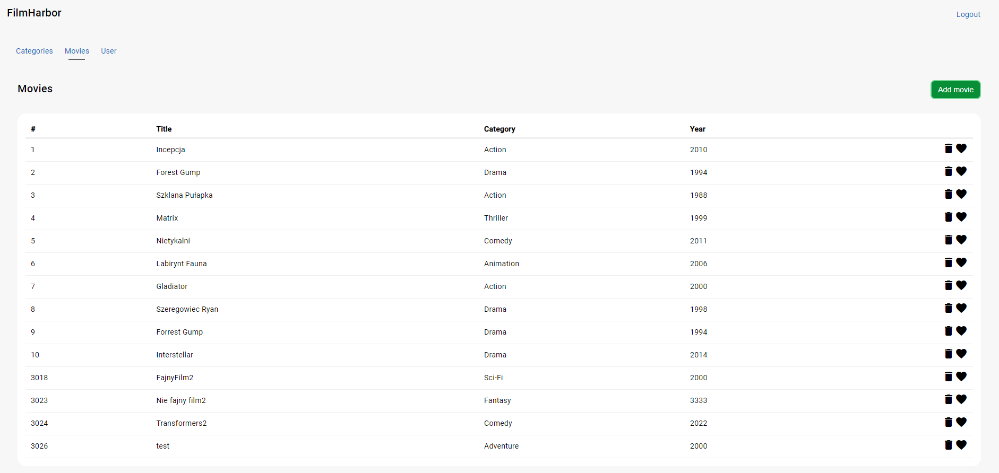

# FilmHarbor - Personal Movie Catalog

FilmHarbor is a web application designed for movie enthusiasts who want to create and manage their personal movie catalog. This application provides a convenient way to keep track of your favorite movies and assists those who are undecided in choosing a movie for their next watch.

## Table of Contents
- [About The Project](#about-the-project)
- [Database Description](#database-description)
- [ERD Diagram](#erd-diagram)
- [Prerequisites](#prerequisites)
- [Installation](#installation)
- [Usage](#usage)
- [Roadmap](#roadmap)
- [Contributing](#contributing)
- [License](#license)
- [Contact](#contact)

## About The Project

## Database Description
### One-to-Many Relationship between Users and Favorite Movies:
- **Users** table has a primary key `UserId`.
- **FavoriteMovies** table has two foreign keys, `UserId` and `MovieId`, both referencing the `UserId` in the **Users** table and `MovieId` in the **Movies** table, respectively.
- This implies that one user can have multiple favorite movies, forming a one-to-many relationship.

### One-to-Many Relationship between Movies and Categories:
- **Movies** table has a primary key `MovieId`.
- **Categories** table has a foreign key `CategoryId` referencing the `CategoryId` in the **Movies** table.
- This implies that one movie can belong to a single category, forming a one-to-many relationship.

### One-to-Many Relationship between Movies and Reviews:
- **Movies** table has a primary key `MovieId`.
- **Reviews** table has two foreign keys, `MovieId` and `UserId`, both referencing the `MovieId` in the **Movies** table and `UserId` in the **Users** table, respectively.
- This implies that one movie can have multiple reviews, forming a one-to-many relationship.

## ERD Diagram

## Built With
To run FilmHarbor locally, you need the following software installed:

- .Net 7
- Angular CLI 17
- Node 21

## Installation
1. Clone the repository to your local machine:
git clone https://github.com/0WhoAmI/FilmHarbor.git
2. Navigate to the project directory:
cd FilmHarbor
3. Install the project dependencies:
npm install
4. Start the development server:
ng serve
5. Open your web browser and go to http://localhost:4200 to access FilmHarbor.
Usage
For more examples, please refer to the [Documentation](#).

## Usage
Use this space to show useful examples of how the project can be used. Additional screenshots, code examples, and demos work well in this space. You may also link to more resources.

## Roadmap
- Find best movies in different categories.
- Create a watchlist of favorite movies.
- Share thoughts and reviews about watched movies in the community.
- Create a community where users can discuss and recommend movies.

Feel free to tailor the descriptions based on the actual features and their specifics in your project. Providing clear and detailed information can help users better understand the roadmap and goals of your project.

## Contributing
Contributions are welcome! If you have a suggestion to improve this project, please fork the repo and create a pull request. You can also open an issue with the tag "enhancement". Don't forget to give the project a star! Thanks again!

1. Fork the Project
2. Create your Feature Branch (git checkout -b feature/AmazingFeature)
3. Commit your Changes (git commit -m 'Add some AmazingFeature')
4. Push to the Branch (git push origin feature/AmazingFeature)
5. Open a Pull Request

## License
Distributed under the GNU Affero General Public License (AGPL) version 3.0.

## Contact
Bartłomiej - @0WhoAmI

Project Link: [https://github.com/0WhoAmI/FilmHarbor](https://github.com/0WhoAmI/FilmHarbor)
